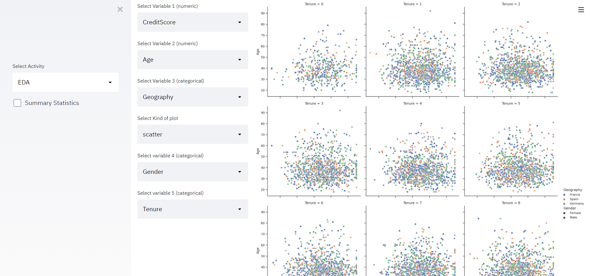
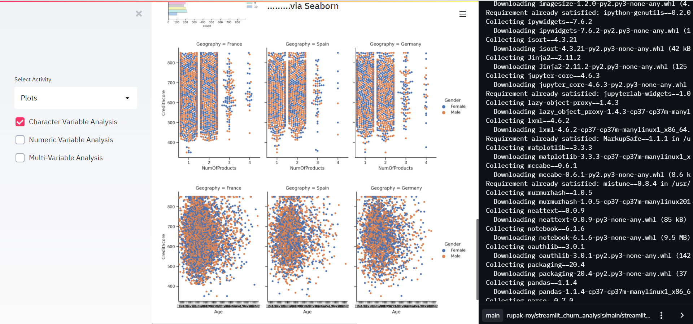
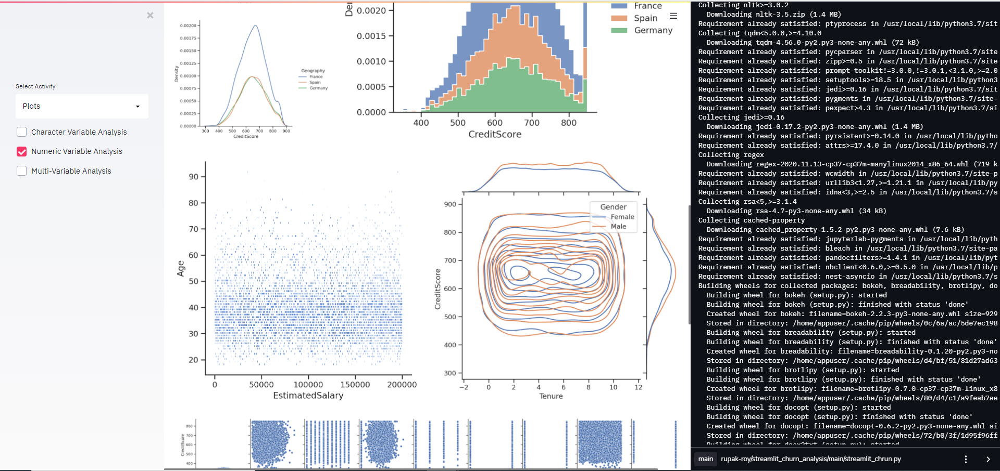

# Welcome to Streamlit Churn | Customer Retention Analysis

Advance In-Depth Churn/Customer Retention Analysis combining the power of Seaborn, Random Forest with Streamlit 
Note: Computationally expensive. Thus requirements time to process 

